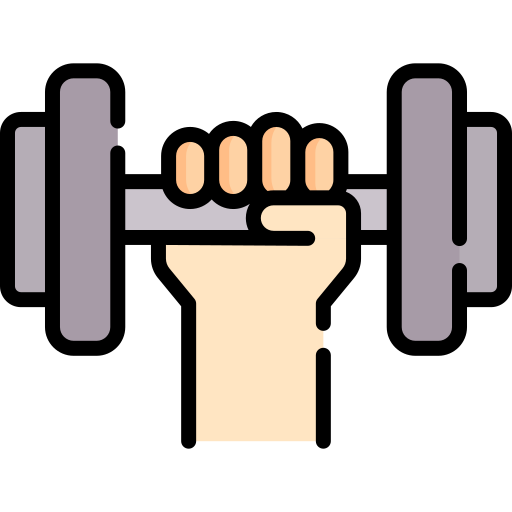
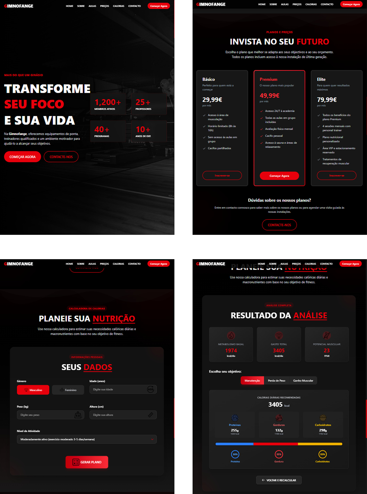

# Gimnofange - Academia Virtual



## 📱 Live Demo

**Website**: [Gimnofange Academia](https://trydavidqix.github.io/Gimnofange/)  
**Repository**: [GitHub](https://github.com/trydavidqix/Gimnofange)

## 📝 Descrição

Gimnofange é um website completo para uma academia virtual que oferece diversos serviços de fitness e saúde. A plataforma apresenta informações sobre aulas disponíveis, preços, e inclui uma calculadora avançada de calorias e macronutrientes para os usuários planejarem sua dieta de acordo com seus objetivos fitness.

## ✨ Funcionalidades

- **Design Responsivo**: Layout adaptativo para dispositivos móveis e desktop
- **Navegação Fluída**: Interface de usuário intuitiva e fácil de usar
- **Seções Informativas**: Apresentação da academia, aulas disponíveis, preços e contato
- **Calculadora de Calorias**: Ferramenta avançada para calcular necessidades calóricas baseada em:
  - Idade, gênero, peso, altura
  - Nível de atividade física
  - Objetivos (manutenção, perda de peso ou ganho muscular)
- **Macronutrientes Personalizados**: Recomendações de proteínas, gorduras e carboidratos
- **Potencial Muscular**: Estimativa de potencial muscular baseado em dados biométricos
- **Animações Modernas**: Elementos animados para melhorar a experiência do usuário

## 🛠️ Tecnologias Utilizadas

### Frontend

- **React 19** - Framework JavaScript para UI
- **TypeScript** - Tipagem estática para JavaScript
- **Vite** - Bundler e ferramenta de desenvolvimento
- **React Router DOM** - Sistema de roteamento
- **Tailwind CSS 4** - Framework CSS utility-first
- **Framer Motion** - Biblioteca para animações fluidas

### Ferramentas de Desenvolvimento

- **ESLint** - Linting e padronização de código
- **TypeScript-ESLint** - Integrações ESLint para TypeScript
- **SWC** - Compilador JavaScript rápido (via plugin Vite)

## 📊 Calculadoras Integradas

### Calculadora de Calorias

A aplicação incorpora algoritmos avançados para cálculos nutricionais e fitness:

- Cálculo BMR (Taxa Metabólica Basal)
- Ajuste por nível de atividade física
- Estimativas para diferentes objetivos (manutenção, perda de peso, ganho muscular)

### Macronutrientes

O sistema calcula automaticamente as necessidades de macronutrientes para três abordagens diferentes:

- Distribuição moderada
- Baixo carboidrato
- Alto carboidrato

## 📸 Screenshots

### Versão Mobile


### Versão Tablet



## 🚀 Como Executar o Projeto

```bash
# Clone o repositório
git clone https://github.com/trydavidqix/Gimnofange.git

# Entre no diretório
cd Gimnofange

# Instale as dependências
npm install

# Execute em modo de desenvolvimento
npm run dev

# Para construir para produção
npm run build
```

## 🧩 Estrutura do Projeto

```plaintext
src/
├── App.tsx              # Componente principal
├── assets/
│   ├── components/      # Componentes reutilizáveis
│   │   ├── Button.tsx
│   │   ├── CaloriasCalculadora.tsx
│   │   ├── CountUp.tsx
│   │   ├── Footer.tsx
│   │   ├── Header.tsx
│   │   ├── RotatingText.tsx
│   │   └── TiltedCard.tsx
│   ├── pages/           # Páginas/Seções principais
│   │   ├── Aulas.tsx
│   │   ├── Contacto.tsx
│   │   ├── Hero.tsx
│   │   ├── Precos.tsx
│   │   └── Sobre.tsx
│   ├── images/          # Recursos de imagens
│   └── utils/           # Utilitários e funções de cálculo
│       ├── calorias.ts
│       └── macronutrientes.ts
└── main.tsx             # Ponto de entrada da aplicação
```

## 📝 Autor

Desenvolvido por David

## 📄 Licença

Este projeto está sob a licença MIT
